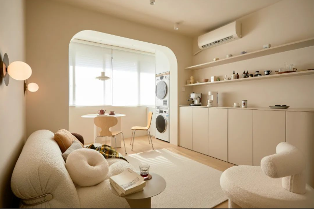

### 奶油风

1. 色彩特点:
  
  - 以柔和的米色、米黄色、浅灰色等为主基调,营造温馦舒适的氛围。
  - 可搭配少量浅蓝色、浅绿色等清新色彩,增加空间的层次感。
2. 材质选择:
  
  - 大量使用木质元素,如实木家具、木地板等,营造自然质朴的感觉。
  - 选用丝绒、麻料等柔软质地的布艺,增加空间的温馨感。
  - 适当使用大理石、瓷砖等材质,增加空间的高级感。
3. 家具造型:
  
  - 家具造型以简约、优雅为主,避免过于复杂的造型。
  - 常见的家具有实木床、实木餐桌椅、布艺沙发等。
4. 装饰元素:
  
  - 大量使用自然元素,如绿植、木质摆件等,营造自然舒适的氛围。
  - 适当使用金属、水晶等装饰品,增加空间的高级感。
  - 可搭配复古风格的灯具、挂画等,增加空间的复古韵味。
5. 整体效果:
  
  - 整体营造一种温馨、舒适、优雅的居住氛围。
  - 空间给人一种干净、清新、高级的感觉。

总之,奶油风装修追求自然质朴与高级感的完美结合,给人一种温馨舒适的居住体验。

### 现代风

1. 色彩特点:
  
  - 以白色、灰色、黑色等中性色调为主基调,营造简约大气的氛围。
  - 可适当搭配一些鲜艳色彩,如红色、蓝色等,增加空间的活力感。
2. 材质选择:
  
  - 大量使用钢化玻璃、不锈钢、大理石等现代感强的材质。
  - 木质元素也常被使用,但多为经过特殊处理的现代风格木材。
  - 布艺选择以简洁大方的设计为主,如皮革、麂皮等。
3. 家具造型:
  
  - 家具造型以简约、几何、线条感强为主。
  - 常见的家具有悬浮式茶几、极简沙发、金属餐桌椅等。
4. 装饰元素:
  
  - 大量使用几何图形、金属质感的装饰品,如金属壁灯、几何挂画等。
  - 适当使用一些自然元素,如绿植、木质摆件等,增加空间的温馨感。
  - 照明设计也很重要,常见的有轨道灯、吊灯等。
5. 整体效果:
  
  - 整体营造一种简约、时尚、高级的居住氛围。
  - 空间给人一种干净、明亮、极简的感觉。

总之,现代风格装修追求简约、时尚、高级的视觉效果,给人一种干净利落的居住体验。

### 轻奢风

1. 色彩特点:
  
  - 以米色、浅灰色、浅驼色等柔和中性色调为主基调。
  - 适当搭配一些金色、银色等金属色调,增加空间的高级感。
  - 可以使用一些深色调,如深灰色、深蓝色等,增加空间的层次感。
2. 材质选择:
  
  - 大量使用天然材质,如大理石、木质、皮革等。
  - 适当使用一些金属元素,如不锈钢、铜等,增加空间的质感。
  - 布艺选择以丝绒、天鹅绒等高档面料为主。
3. 家具造型:
  
  - 家具造型以简约大气、线条流畅为主。
  - 常见的家具有实木家具、皮质沙发、金属茶几等。
4. 装饰元素:
  
  - 大量使用奢华装饰品,如水晶吊灯、金属壁画等。
  - 适当使用一些自然元素,如绿植、干花等,增加空间的温馨感。
  - 可以搭配一些复古元素,如古董摆件、复古灯具等。
5. 整体效果:
  
  - 整体营造一种高级、优雅、舒适的居住氛围。
  - 空间给人一种奢华、时尚、高品质的感觉。

总之,轻奢风格装修追求高品质、优雅、舒适的视觉效果,给人一种高级感受。

### 极简风

1. 色彩特点:
  
  - 以白色、灰色、黑色等中性色调为主基调,营造简洁干净的氛围。
  - 可适当使用一些木质色调,如浅木色等,增加空间的温馨感。
  - 整体色彩搭配简单明了,避免过于丰富的色彩搭配。
2. 材质选择:
  
  - 大量使用钢化玻璃、不锈钢、大理石等简洁高级的材质。
  - 木质元素也常被使用,但多为经过特殊处理的现代风格木材。
  - 布艺选择以简约大方的设计为主,如皮革、麂皮等。
3. 家具造型:
  
  - 家具造型以简约、几何、线条感强为主。
  - 常见的家具有悬浮式茶几、极简沙发、金属餐桌椅等。
4. 装饰元素:
  
  - 装饰品极少,以简单的几何图形、金属质感为主。
  - 适当使用一些自然元素,如绿植、木质摆件等,增加空间的温馨感。
  - 照明设计也很重要,常见的有轨道灯、吊灯等简洁大气的灯具。
5. 整体效果:
  
  - 整体营造一种简约、干净、高级的居住氛围。
  - 空间给人一种极简、清爽、高品质的感觉。

总之,极简风格装修追求简约、干净、高级的视觉效果,给人一种清爽利落的居住体验。

### 原木风

1. 色彩特点:
  
  - 以原木色调为主基调,包括浅棕色、中棕色、深棕色等。
  - 可适当搭配一些白色、米色等中性色调,增加空间的层次感。
  - 整体色彩以自然质朴为主,避免过于鲜艳的色彩。
2. 材质选择:
  
  - 大量使用实木材质,如实木地板、实木家具等。
  - 适当使用一些石材,如大理石、砖石等,增加空间的质感。
  - 布艺选择以自然纤维为主,如亚麻、棉麻等。
3. 家具造型:
  
  - 家具造型以简约自然、质朴大气为主。
  - 常见的家具有实木床、实木餐桌椅、实木书柜等。
4. 装饰元素:
  
  - 大量使用自然元素,如绿植、木质摆件、藤编装饰品等。
  - 适当使用一些金属元素,如铜、铁等,增加空间的质感。
  - 可以搭配一些复古元素,如复古灯具、复古挂画等。
5. 整体效果:
  
  - 整体营造一种自然、质朴、温馨的居住氛围。
  - 空间给人一种原生态、舒适、回归自然的感觉。

总之,原木风格装修追求自然质朴、温馨舒适的视觉效果,给人一种返璞归真的居住体验。

### 新中式

1. 色彩特点:
  
  - 以深沉的红色、棕色、黑色等为主基调,营造典雅大气的氛围。
  - 可适当搭配一些白色、米色等中性色调,增加空间的层次感。
  - 整体色彩以中式传统色彩为主,但会有一些现代感的融合。
2. 材质选择:
  
  - 大量使用实木、竹、藤等自然材质,体现中式风格。
  - 适当使用一些现代材质,如钢化玻璃、大理石等,增加空间的质感。
  - 布艺选择以丝绸、绣花等中式元素为主。
3. 家具造型:
  
  - 家具造型融合了中式传统与现代元素,体现新中式风格。
  - 常见的家具有实木雕花家具、中式屏风、现代简约沙发等。
4. 装饰元素:
  
  - 大量使用中式传统元素,如中式挂画、瓷器、书法作品等。
  - 适当使用一些现代装饰品,如金属摆件、几何图案等,增加空间的时尚感。
  - 可以搭配一些自然元素,如绿植、园艺小品等。
5. 整体效果:
  
  - 整体营造一种中式传统与现代元素的完美融合。
  - 空间给人一种典雅大气、时尚优雅的感觉。

总之,新中式风格装修追求中西合璧、传统与现代的完美结合,给人一种独特的居住体验。

### 法式

1. 色彩特点:
  
  - 以柔和的米色、浅灰色、浅蓝色等为主基调,营造优雅温馨的氛围。
  - 可适当搭配一些浅粉色、浅绿色等柔和色彩,增加空间的层次感。
  - 整体色彩以淡雅、优雅为主,避免过于鲜艳的色彩。
2. 材质选择:
  
  - 大量使用实木、大理石、铁艺等高档材质。
  - 布艺选择以丝绒、天鹅绒、蕾丝等柔软高贵的面料为主。
  - 适当使用一些金属元素,如铜、铁等,增加空间的质感。
3. 家具造型:
  
  - 家具造型以优雅、精致、复古为主。
  - 常见的家具有实木雕花家具、铁艺床、古典沙发等。
4. 装饰元素:
  
  - 大量使用欧式复古元素,如水晶吊灯、古典挂画、雕花镜框等。
  - 适当使用一些自然元素,如绿植、鲜花等,增加空间的生机。
  - 可以搭配一些法式乡村风格的装饰品,如蕾丝窗帘、格子抱枕等。
5. 整体效果:
  
  - 整体营造一种优雅、高贵、浪漫的居住氛围。
  - 空间给人一种古典典雅、温馨舒适的感觉。

总之,法式风格装修追求优雅、高贵、浪漫的视觉效果,给人一种古典典雅的居住体验。

### 意式

1. 色彩特点:
  
  - 以暖色调为主基调,如深棕色、橙色、红色等。
  - 可适当搭配一些中性色调,如米色、浅灰色等,增加空间的层次感。
  - 整体色彩以温馨、优雅为主,营造舒适的居住氛围。
2. 材质选择:
  
  - 大量使用天然材质,如实木、大理石、皮革等。
  - 适当使用一些金属元素,如铜、铁艺等,增加空间的质感。
  - 布艺选择以丝绒、天鹅绒等柔软高贵的面料为主。
3. 家具造型:
  
  - 家具造型以优雅、精致、曲线感强为主。
  - 常见的家具有实木雕花家具、皮质沙发、古典餐桌椅等。
4. 装饰元素:
  
  - 大量使用意式乡村风格的装饰品,如陶瓷花瓶、铜制烛台等。
  - 适当使用一些自然元素,如绿植、干花等,增加空间的生机。
  - 可以搭配一些复古元素,如复古灯具、复古挂画等。
5. 整体效果:
  
  - 整体营造一种温馨、优雅、舒适的居住氛围。
  - 空间给人一种浪漫、典雅、高品质的感觉。

总之,意式风格装修追求温馨、优雅、舒适的视觉效果,给人一种浪漫典雅的居住体验。
